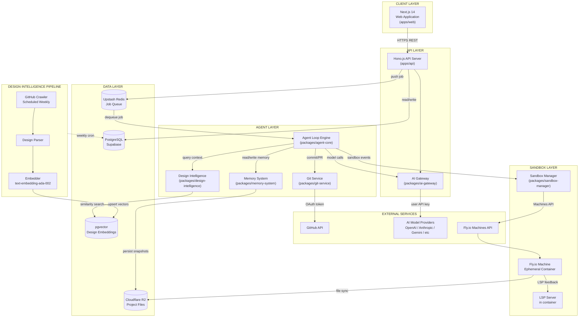
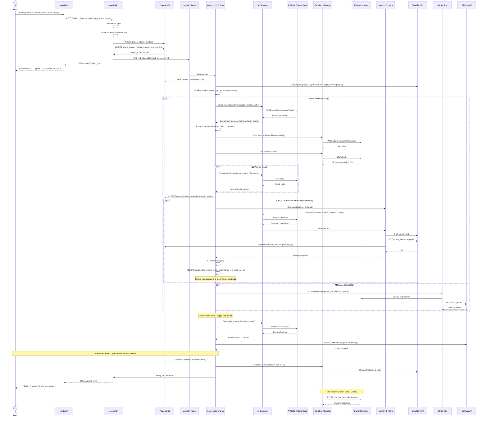
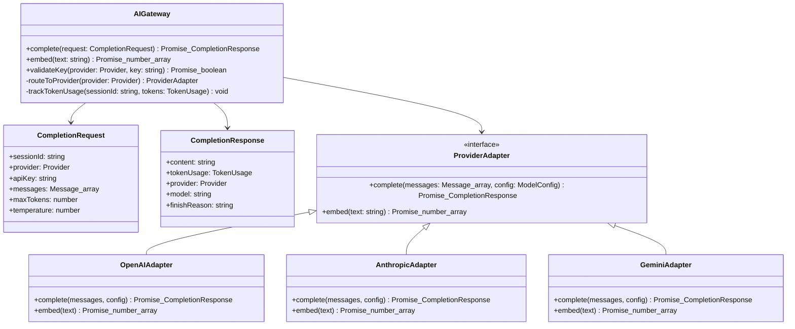
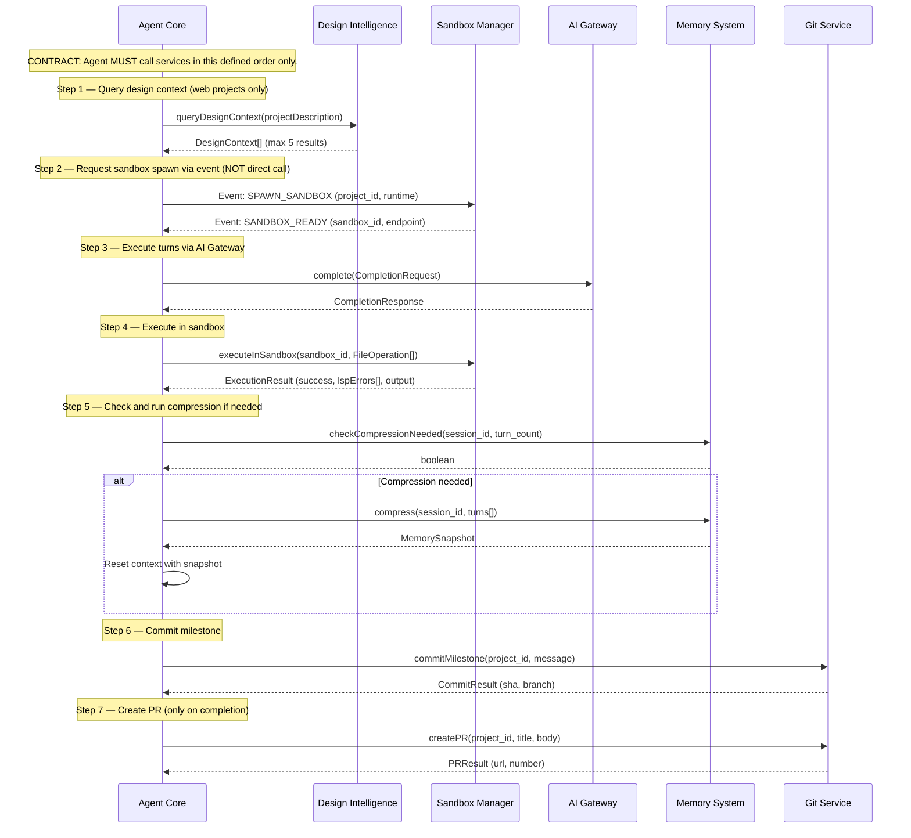
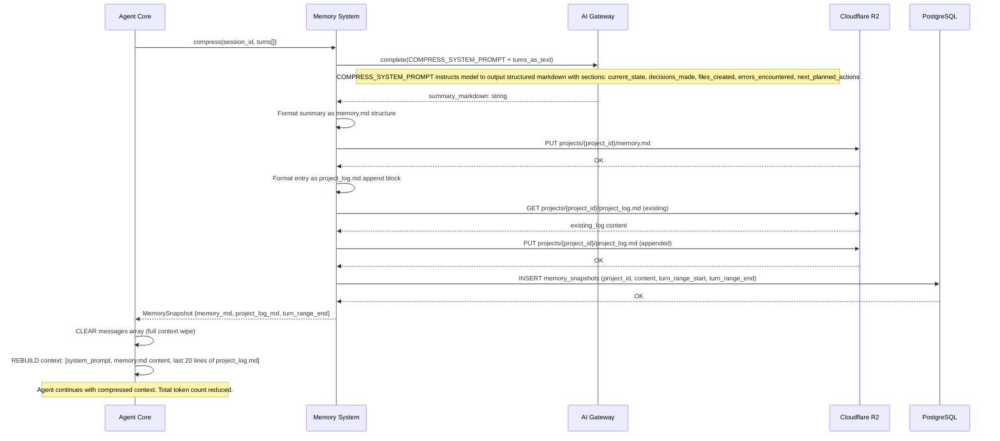
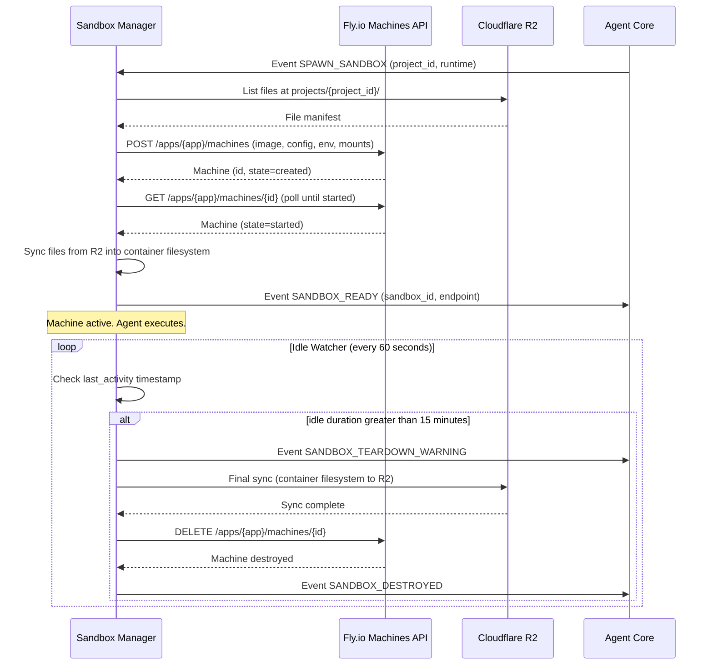
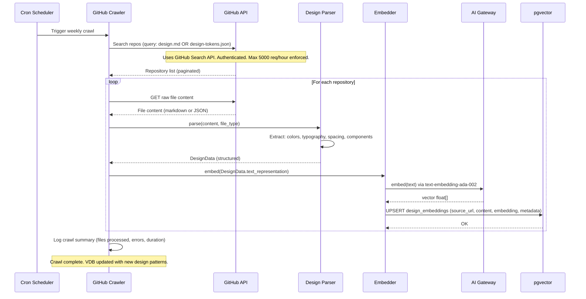

# ARCHITECTURE.md — Pylon
<!-- AI-READABLE: YES. MCES format. All rules use MUST/MUST NOT/REQUIRED/PROHIBITED. -->
<!-- VERSION: 1.0 | STATUS: AUTHORITATIVE | DATE: 2026-05-04 -->
<!-- Cross-reference: PRD.md for capability definitions, AGENTS.md for coding rules -->

---

# BLUEPRINT HEADER

```
Blueprint Version  : 1.0
Project Name       : Pylon
Architecture Style : Modular Monolith (Monorepo) + Ephemeral Sandbox Model
System Scope       : MVP Phases 0–2
Monorepo Tool      : Turborepo
Primary Language   : TypeScript (Node.js 20 LTS)
```

---

# SECTION 1: CONTEXT LOCK

## Runtimes

| Runtime | Version | Scope |
|---|---|---|
| Node.js | EXACT_VERSION 20.x LTS | Main app (API + Frontend + all packages) |
| TypeScript | EXACT_VERSION 5.4.x | All packages |
| Python | EXACT_VERSION 3.12.x | Sandbox only (user projects) |
| Go | EXACT_VERSION 1.22.x | Sandbox only (user projects) |

## Database

| Component | Technology | Note |
|---|---|---|
| Primary DB | PostgreSQL 15 via Supabase | Auth + RLS + pgvector built-in |
| Vector Store | pgvector extension | Same Supabase instance — no separate service |
| Job Queue | Redis via Upstash | Serverless; queue + pub/sub |

## ORM
- REQUIRED: Drizzle ORM — explicit queries, TypeScript-native, no magic
- PROHIBITED: Prisma — too heavy, implicit behavior
- PROHIBITED: Raw SQL in application layer (migrations only exception)

## Allowed Libraries (Main App)

```
hono                    — HTTP server framework
drizzle-orm             — database ORM
@supabase/supabase-js   — auth + storage client
ioredis                 — Redis client for Upstash
zod                     — input validation (API boundary only)
jose                    — JWT parsing and verification
pino                    — structured JSON logging
@aws-sdk/client-s3      — Cloudflare R2 (S3-compatible) file operations
openai                  — OpenAI API SDK
@anthropic-ai/sdk       — Anthropic API SDK
@google/generative-ai   — Google Gemini SDK
date-fns                — date utilities
```

## Forbidden Libraries (Main App)
- PROHIBITED: `express` — use Hono
- PROHIBITED: `mongoose` — use Drizzle
- PROHIBITED: `moment` — use `date-fns`
- PROHIBITED: `lodash` — use native TypeScript utilities
- PROHIBITED: any ORM with implicit lazy loading
- PROHIBITED: `sequelize`
- PROHIBITED: `typeorm`

## Dependency Direction (STRICT)
```
Presentation → API → Service → Repository → Database
              ↓
           Queue → Agent Core → AI Gateway → External Models
                             → Sandbox Manager → Fly.io
                             → Memory System → R2
                             → Git Service → GitHub API
                             → Design Intelligence → pgvector
```
- PROHIBITED: Presentation Layer imports Service Layer directly
- PROHIBITED: Repository Layer calls external APIs
- PROHIBITED: Service Layer imports from Presentation Layer
- PROHIBITED: Circular imports between any packages
- PROHIBITED: API Layer queries database directly (must go through Service Layer)

---

# SECTION 2: ARCHITECTURAL BOUNDARIES

## Layer Definitions

```
┌──────────────────────────────────────────────────────┐
│  PRESENTATION LAYER  — apps/web (Next.js 14)         │
│  Responsibility: Render UI, poll API, display state  │
├──────────────────────────────────────────────────────┤
│  API LAYER           — apps/api (Hono.js)            │
│  Responsibility: Validate input, auth, route to svc  │
├──────────────────────────────────────────────────────┤
│  SERVICE LAYER       — packages/*                    │
│  Responsibility: Business logic, orchestration       │
├──────────────────────────────────────────────────────┤
│  REPOSITORY LAYER    — inside each service package   │
│  Responsibility: DB queries only, no business logic  │
├──────────────────────────────────────────────────────┤
│  INFRASTRUCTURE      — DB, Queue, R2, Fly.io         │
│  Responsibility: Persistence, compute, messaging     │
└──────────────────────────────────────────────────────┘
```

## Allowed Call Flows
- Presentation → API: HTTP/HTTPS REST only
- API → Service Layer: direct TypeScript import (monorepo package)
- Service Layer → Repository Layer: direct import within same package
- Repository Layer → Database: Drizzle ORM queries only
- Agent Core → AI Gateway: direct import
- Agent Core → Sandbox Manager: event/queue-based ONLY (no direct import)
- Agent Core → Memory System: direct import
- Agent Core → Git Service: direct import
- Agent Core → Design Intelligence: direct import (read-only)

## Cross-Layer Rules
- ALL inter-layer data MUST be typed with explicit TypeScript interfaces
- ALL external API calls MUST go through dedicated adapter modules
- ALL input validation MUST happen at API Layer boundary using Zod
- Business logic MUST NOT exist in Repository Layer
- Repository Layer MUST return plain data objects (no ORM model instances exposed to service layer)

---

# SECTION 3: DATA MODEL CONTRACT

## Normalization Level: 3NF (Third Normal Form)
- Exception: `agent_turns.token_count` denormalized for fast token billing aggregation

## Table Definitions

### `users`
```sql
id            UUID        PRIMARY KEY DEFAULT gen_random_uuid()
email         TEXT        UNIQUE NOT NULL
github_id     TEXT        UNIQUE
github_token  TEXT        -- AES-256 encrypted; NEVER returned in API responses
created_at    TIMESTAMPTZ DEFAULT now()
updated_at    TIMESTAMPTZ DEFAULT now()
```

### `api_keys`
```sql
id            UUID        PRIMARY KEY DEFAULT gen_random_uuid()
user_id       UUID        REFERENCES users(id) ON DELETE CASCADE
provider      TEXT        NOT NULL  -- 'openai' | 'anthropic' | 'gemini' | 'mistral' | 'cohere'
key_encrypted TEXT        NOT NULL  -- AES-256 encrypted; NEVER returned in API responses
key_hint      TEXT        NOT NULL  -- last 4 chars only, for UI display
created_at    TIMESTAMPTZ DEFAULT now()
```

### `projects`
```sql
id             UUID        PRIMARY KEY DEFAULT gen_random_uuid()
user_id        UUID        REFERENCES users(id) ON DELETE CASCADE
name           TEXT        NOT NULL
app_type       TEXT        NOT NULL  -- 'cli' | 'web' | 'desktop' | 'mobile'
runtime        TEXT        NOT NULL  -- 'nodejs' | 'python' | 'go' | 'flutter'
status         TEXT        NOT NULL DEFAULT 'idle'
                           -- 'idle' | 'building' | 'paused' | 'completed' | 'failed'
repo_url       TEXT        -- GitHub repo URL; null until connected
sandbox_id     TEXT        -- Fly.io machine ID; null when no active sandbox
model_provider TEXT        NOT NULL
created_at     TIMESTAMPTZ DEFAULT now()
updated_at     TIMESTAMPTZ DEFAULT now()
```

### `agent_sessions`
```sql
id                 UUID        PRIMARY KEY DEFAULT gen_random_uuid()
project_id         UUID        REFERENCES projects(id) ON DELETE CASCADE
status             TEXT        NOT NULL DEFAULT 'running'
                               -- 'running' | 'compressing' | 'paused' | 'completed' | 'failed'
turn_count         INT         NOT NULL DEFAULT 0
compression_count  INT         NOT NULL DEFAULT 0
autonomous_mode    BOOLEAN     NOT NULL DEFAULT false
started_at         TIMESTAMPTZ DEFAULT now()
ended_at           TIMESTAMPTZ
last_activity      TIMESTAMPTZ DEFAULT now()
```

### `agent_turns`
```sql
id            UUID        PRIMARY KEY DEFAULT gen_random_uuid()
session_id    UUID        REFERENCES agent_sessions(id) ON DELETE CASCADE
turn_number   INT         NOT NULL
role          TEXT        NOT NULL  -- 'user' | 'assistant' | 'tool'
content       TEXT        NOT NULL
token_count   INT         NOT NULL DEFAULT 0
created_at    TIMESTAMPTZ DEFAULT now()
```

### `memory_snapshots`
```sql
id               UUID        PRIMARY KEY DEFAULT gen_random_uuid()
project_id       UUID        REFERENCES projects(id) ON DELETE CASCADE
snapshot_type    TEXT        NOT NULL  -- 'memory' | 'log'
content          TEXT        NOT NULL
turn_range_start INT         NOT NULL
turn_range_end   INT         NOT NULL
created_at       TIMESTAMPTZ DEFAULT now()
```

### `design_embeddings` (DIP)
```sql
id           UUID        PRIMARY KEY DEFAULT gen_random_uuid()
source_url   TEXT        NOT NULL
source_type  TEXT        NOT NULL  -- 'design_md' | 'tokens_json' | 'style_guide'
content      TEXT        NOT NULL
embedding    VECTOR(1536)           -- pgvector; OpenAI text-embedding-ada-002
metadata     JSONB
crawled_at   TIMESTAMPTZ DEFAULT now()
```

### `skills`
```sql
id              UUID        PRIMARY KEY DEFAULT gen_random_uuid()
project_id      UUID        REFERENCES projects(id) ON DELETE CASCADE  -- NULL = global skill
name            TEXT        NOT NULL
description     TEXT        NOT NULL
implementation  TEXT        NOT NULL  -- skill script/code
created_by      TEXT        NOT NULL  -- 'agent' | 'system'
version         INT         NOT NULL DEFAULT 1
created_at      TIMESTAMPTZ DEFAULT now()
```

## Index Policy
- REQUIRED: Index all foreign key columns
- REQUIRED: `projects(user_id)`, `projects(status)`
- REQUIRED: `agent_sessions(project_id)`, `agent_sessions(status)`
- REQUIRED: `agent_turns(session_id, turn_number)`
- REQUIRED: GiST index on `design_embeddings(embedding)` for vector similarity search
- PROHIBITED: Full-text index on `memory_snapshots.content` (not needed at MVP scale)

## Constraint Policy
- ALL foreign keys MUST have `ON DELETE CASCADE` unless explicitly justified with comment
- ALL enum-like text fields MUST be validated at application layer (not DB-level CHECK)
- ALL timestamps MUST be `TIMESTAMPTZ` — NEVER use `TIMESTAMP`
- `api_keys.key_encrypted` MUST NEVER appear in any API response at any layer
- `users.github_token` MUST NEVER appear in any API response at any layer

---

# SECTION 4: EXECUTION CONSTRAINTS

## Async Policy
- ALL I/O operations MUST be async/await
- PROHIBITED: Blocking operations inside API request handlers
- Agent Loop Engine MUST run as background job consumer — NEVER as HTTP request handler
- MAX timeout per sandbox operation: 300 seconds
- MAX timeout per external AI API call: 120 seconds
- MAX timeout per R2 file operation: 30 seconds

## Transaction Policy
- Multi-table writes MUST use database transactions
- Project creation (project record + agent_session record) MUST be atomic
- Memory compression (write snapshot + update session turn_count) MUST be atomic
- MAX transaction duration: 5 seconds

## Logging Policy
- REQUIRED: Structured JSON logging via Pino
- REQUIRED: Log levels: error, warn, info, debug
- REQUIRED: Every API request logged: method, path, status_code, duration_ms, user_id
- REQUIRED: Every agent turn logged: session_id, turn_number, token_count, provider
- PROHIBITED: API keys in any log output — at any log level
- PROHIBITED: Full AI model response content in production logs (log token count + finish_reason only)
- REQUIRED: Error logs MUST include: error_code, message, stack_trace, user_id, project_id

## Error Handling Policy
- ALL async functions MUST have try/catch
- API Layer MUST return standardized error format:
```json
{
  "error": {
    "code": "ERROR_CODE_SNAKE_UPPER",
    "message": "Human-readable description",
    "details": {}
  }
}
```
- Agent errors MUST be either: recoverable (retry with backoff) OR gracefully terminal (job paused + logged)
- PROHIBITED: Unhandled promise rejections in production
- REQUIRED: Circuit breaker on external AI API calls — threshold: 5 failures in 60 seconds

## Validation Policy
- ALL API inputs MUST be validated with Zod schemas at API boundary
- Validation error MUST return HTTP 422 with field-level detail
- API keys MUST be validated for format before storage (not content — content validated at first use)
- PROHIBITED: Trust any user input without schema validation

---

# SECTION 5: INTEGRATION CONTRACTS

## Module Rules
- `packages/agent-core` MUST NOT import `packages/sandbox-manager` directly
  → Communication via Redis queue/events only
- `packages/ai-gateway` MUST expose a provider-agnostic interface only
  → Callers MUST NOT know which provider is active
- `packages/design-intelligence` is READ-ONLY from agent perspective
  → PROHIBITED: agent writes to design_embeddings table
- `packages/git-service` MUST NOT execute without a valid, non-expired GitHub token
- `packages/memory-system` MUST be stateless (reads/writes to R2 and DB only)

## File System Rules
- Project files stored in R2 under path: `projects/{project_id}/`
- memory.md path: `projects/{project_id}/memory.md`
- project_log.md path: `projects/{project_id}/project_log.md`
- Sandbox MUST sync files from R2 on container start
- Sandbox MUST sync files back to R2 before container teardown
- File writes inside sandbox MUST be atomic (write temp → rename)
- MAX project size: 500MB (enforced at write time)
- MAX files per project: 10,000

## External Service Rules
- Fly.io API: auth via server-side env var `FLY_API_TOKEN` — NEVER client-facing
- GitHub API: auth via user's OAuth token — scoped per request
- AI Providers: auth via user's API key — decrypted only at AI Gateway call time
- R2: auth via server-side env var `R2_API_TOKEN` — NEVER client-facing
- Upstash Redis: auth via server-side env var `UPSTASH_REDIS_URL` — NEVER client-facing

## Security Rules
- ALL endpoints except `/health`, `/auth/login`, `/auth/callback` MUST require valid session
- Users MUST only access their own projects — enforced via Supabase Row Level Security (RLS)
- API keys MUST be encrypted with AES-256 before DB storage
- API keys MUST be decrypted only inside AI Gateway, immediately before model call
- Sandbox containers MUST have no network access except to package registries and AI provider APIs
- Sandbox containers MUST have no access to other users' R2 paths
- Rate limiting: 100 requests/minute per user on all endpoints
- PROHIBITED: `Access-Control-Allow-Origin: *` in production
- PROHIBITED: Server-side secrets in any client-side code or frontend env vars

---

# SECTION 6: VERIFICATION RULES

## Acceptance Scenarios

| ID | Scenario | Expected Result |
|---|---|---|
| ACC-01 | User logs in via GitHub OAuth | Session created; github_token stored encrypted |
| ACC-02 | User creates project and submits prompt | Job queued; sandbox spawned < 8s; agent starts |
| ACC-03 | Agent reaches turn 50 | Memory compression triggered; memory.md written; context reset |
| ACC-04 | Agent session resumed after compression | Reads memory.md; continues from correct state |
| ACC-05 | User exports project as ZIP | ZIP contains all files + Dockerfile |
| ACC-06 | Agent pushes to GitHub | PR created on dev branch — NOT directly to main |
| ACC-07 | AI model returns HTTP 429 (rate limit) | Backoff retries (3x); job paused; user notified |
| ACC-08 | Sandbox idle 15+ minutes | Container destroyed; project files intact in R2 |
| ACC-09 | Web project generation starts | DIP queried; design context injected into agent prompt |
| ACC-10 | Agent self-review completes | GitHub issue created per finding OR explicit "no issues" log |

## Failure Scenarios

| ID | Scenario | Expected Result |
|---|---|---|
| FAIL-01 | Fly.io API unreachable | Job retried 3x; user notified if all fail |
| FAIL-02 | Invalid API key format submitted | HTTP 422 returned before job created |
| FAIL-03 | Agent turn count hits 500 | Agent terminates gracefully; final state saved |
| FAIL-04 | R2 write fails | 3 retries; job paused with error state |
| FAIL-05 | GitHub token expired during push | Git ops queued; user notified to re-auth |
| FAIL-06 | memory.md write fails | Agent continues without compression; error logged |
| FAIL-07 | DIP returns no results | Agent continues without design context; no failure |
| FAIL-08 | Sandbox OOM | Container restarted; agent resumes from last checkpoint |

## Non-Goals (Do NOT Build at MVP)
- PROHIBITED: Multi-agent parallel execution
- PROHIBITED: Real-time agent streaming via WebSockets
- PROHIBITED: Payment processing
- PROHIBITED: Desktop or mobile app generation
- PROHIBITED: Local model support
- PROHIBITED: Team/collaboration features

---

# SECTION 7: HIGH LEVEL ARCHITECTURE DIAGRAM



---

# SECTION 8: LOW LEVEL ARCHITECTURE DIAGRAM

```mermaid
graph TB
    subgraph API_INT["API LAYER — INTERNAL"]
        ROUTE["Route Handlers\nauth / projects / agent / export"]
        ZOD["Zod Validation\nMiddleware"]
        AUTHMW["Auth Middleware\nSupabase JWT"]
        RATELIM["Rate Limiter\nRedis token bucket"]
        ROUTE --> ZOD --> AUTHMW --> RATELIM
    end

    subgraph AGENT_INT["AGENT CORE — INTERNAL"]
        JR["Job Runner\nQueue Consumer"]
        PLANNER["Task Planner\nDecompose prompt to milestones"]
        EXECLOOP["Execution Loop\nTurn-based state machine"]
        TURNCTR["Turn Counter\nTracks N turns per session"]
        COMPR["Memory Compressor\nTrigger at N turns"]
        SELFREV["Self-Review Module\nPost-completion code review"]
        SELFREF["Self-Refactor Module\nPost-review code improvement"]
        KILLSW["Kill Switch\nUser-triggered abort"]

        JR --> PLANNER --> EXECLOOP
        EXECLOOP --> TURNCTR
        TURNCTR -->|"N == threshold"| COMPR
        COMPR -->|"context reset"| EXECLOOP
        EXECLOOP -->|"all milestones done"| SELFREV
        SELFREV --> SELFREF
        KILLSW -->|"abort signal"| EXECLOOP
    end

    subgraph MEM_INT["MEMORY SYSTEM — INTERNAL"]
        MWRITER["Memory Writer\nFormats + writes memory.md"]
        LWRITER["Log Writer\nAppends to project_log.md"]
        MREADER["Memory Reader\nLoads context on resume"]
        MCOMPRESSOR["Context Compressor\nLLM-based summarization"]

        MCOMPRESSOR --> MWRITER
        MCOMPRESSOR --> LWRITER
        MREADER -->|"provides context to"| EXECLOOP
    end

    subgraph SBX_INT["SANDBOX MANAGER — INTERNAL"]
        SPAWNER["Container Spawner\nFly.io POST /machines"]
        LCMGR["Lifecycle Manager\nIdle timeout watcher"]
        FSYNC["File Sync\nR2 to container on start\nContainer to R2 on stop"]
        LSPCLI["LSP Client\nSyntax validation requests"]
        EXECCLI["Exec Client\nRun commands in container"]

        SPAWNER --> LCMGR
        LCMGR -->|"idle > 15min"| SPAWNER
        FSYNC --> SPAWNER
    end

    subgraph DIP_INT["DESIGN INTELLIGENCE — INTERNAL"]
        GHCRAWL["GitHub Crawler\nRespects rate limits + robots.txt"]
        FILTER["Content Filter\nDesign files only"]
        DIPPARSE["Design Parser\nExtract colors, typography, components"]
        EMBED2["Embedder\ntext-embedding-ada-002"]
        RAGQ["RAG Query Engine\npgvector cosine similarity"]

        GHCRAWL --> FILTER --> DIPPARSE --> EMBED2
        EMBED2 -->|"upsert"| VDB2[("pgvector")]
        RAGQ -->|"query"| VDB2
    end

    subgraph GIT_INT["GIT SERVICE — INTERNAL"]
        GITINIT["Repo Initializer\ngit init + set remote"]
        COMMITMGR["Commit Manager\nMilestone-based commits"]
        BRANCHMGR["Branch Manager\nmain / dev / feature/*"]
        PRMGR["PR Manager\nAuto PR before merge to main"]
        CISETUP["CI Setup\nGitHub Actions yaml generator"]

        GITINIT --> BRANCHMGR --> COMMITMGR --> PRMGR --> CISETUP
    end
```



---

# SECTION 9: DRY RUN LOGIC — END TO END FLOW

## Scenario: User Creates CLI App (Python) — Semi-Autonomous Mode



---

# SECTION 10: INTERNAL CONTRACT DIAGRAMS

## Contract A — AI Gateway Interface (Type Contract)



## Contract B — Agent Core Service Interaction Order



## Contract C — Memory System Compression Protocol



## Contract D — Sandbox Lifecycle



## Contract E — Design Intelligence Pipeline (DIP) Crawl Cycle


